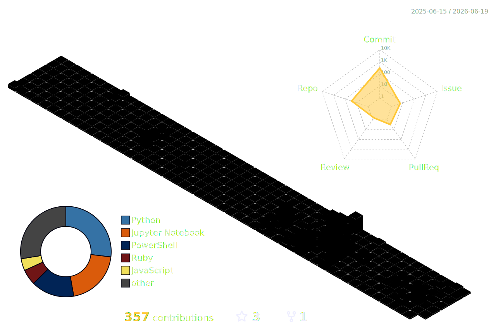

# 💫 Hi there! I am 🛠️

---

## 🎯 About Me

> **High Curiosity and Rapid Idea Thinker** | **Technical Art Enthusiast** | **Research-Driven Builder**

- 🎓 Pursuing a **Bachelor’s degree in Computer Science & Engineering (CSE)**
- 🧠 Driven to apply **open-source** principles wherever possible, fostering **transparency** and **collaboration**, while pushing technology toward **continuous**, **sustainable**, and **limitless** improvement
- 🎨 Exploring **Technical Art**, **Automation**, **Fine-tuned LLMs**, **Cloud Computing**, **3D Web**, and **Creative Frontend**

 

---

## 🧠 Research Interests

- Generative AI for creative tools
- Technical art pipelines and automation
- Human-AI co-creation systems
- Open-source AI infrastructure
- AI-assisted 3D modeling and workflow design

---

## 🛠️ Tech Stack & Tools

### 🎨 Creative & Graphics

### 💻 Frontend & Web

### ⚙️ Programming & Automation

### 📊 AI & Data Science

### ☁️ Cloud & Infrastructure

---

## 📊 GitHub Analytics

  

---

## 🚀 Featured Projects

| Project                       | Description                                                                                                       | Tech Stack                                                        | Status        |
| ----------------------------- | ----------------------------------------------------------------------------------------------------------------- | ----------------------------------------------------------------- | ------------- |
| 🔐 Lockerspace                | Social media dating app for Malaysian-Korean student society                                                      | Azure, KQL, Power BI                                              | 🏗️ Building |
| 🔀 Anyfile Converter          | CLI tool that converts documents and bridges AI assistants' binary limits                                         | Python, PowerShell                                                | ✅ Complete   |
| 🎹 Chromesthesia Chord Engine | ML system that transforms musical chords into generative visuals                                                  | Python, Librosa, ML                                               | ✅ Complete   |
| 🤖 AI Threat Detection        | ML-based anomaly detection for cloud log intelligence                                                             | Python, TensorFlow, Azure Logs                                    | 🔬 Research   |
| 💊 PharmaGPT                  | Domain-specialized LLM assistant for pharmaceutical knowledge and safety                                          | Python, HuggingFace, RAG, FastAPI                                 | 🔬 Research   |
| 📝 Noteerr                    | Minimal developer-focused markdown note system with structured thinking                                           | Next.js, TypeScript, Supabase                                     | 🏗️ Building |
| 🥷 Terminal Ninja             | AI-powered CLI productivity enhancer with intelligent command suggestions                                         | Python, Bash, OpenAI API                                          | 🔬 Research   |
| 🧠 BlendPilot                 | AI co-creator plugin for Blender that assists modeling, segmentation, and automation via MCP                      | Python, Blender API, MCP, Copilot APIs                            | 🏗️ Building |
| 🧰 TinyToys                   | Modular developer utility suite allowing custom scripts, mini-apps, widgets, and productivity toggles             | Rust, Python, Plugin Runtime                                      | 🧠 Concept    |
| 🖥️ RustDesk Display Helper  | Toggle for changing different server display settings for RustDesk remote setup                                   | RustDesk API, Python, Tailscale                                   | ✅ Complete   |
| 📸 Lua .fxlm                  | Darktable Lua-based preset system for cinematic, film-inspired looks importable through `.fxlm` files           | Lua, LUTs, C, C++, Python                                         | 🏗️ Building |
| 📱 UI First                   | Transforms natural language UI prompts into production-ready Tailwind apps via a visual-first workflow in VS Code | Tailwind, API, Penpot                                             | 🏗️ Building |
| 🐝 HiveCube EX-01             | LLM-directed swarm cube robots that self-assemble into voxel-based 3D structures from prompts                     | Robotics, ESP32, Swarm Algorithms, NVIDIA Isaac Sim, LLM Planning | 🔬 Research   |

---

## 🎓 Certifications & Education

**Korea University**
Bachelor of Computer Science & Engineering (CSE)

---

## 🌱 Current Focus

- Building AI-assisted creative tools
- Designing systems that bridge artists and engineers
- Exploring open-source, transparent, and scalable workflows
- Researching practical human-AI collaboration

---

⭐ **Star this repo if you like my profile!**
💡 *Always exploring the space between AI, art, and engineering.*
